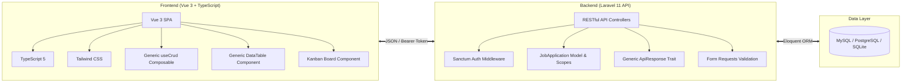
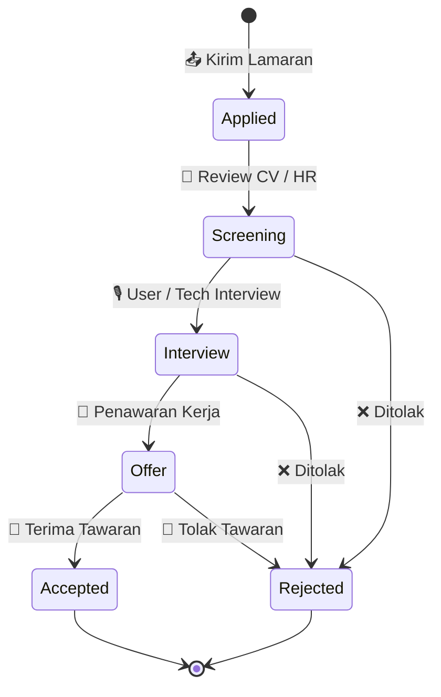

<div align="center">

<!-- Hero Banner Animated Header -->


<!-- Animated Typing Subtitle -->
<p align="center">
  
</p>

<!-- Badges Grid -->
<p align="center">
  
  
  
  
  
  
</p>

<p align="center">
  <a href="#-fitur-utama">Fitur</a> •
  <a href="#-tech-stack--arsitektur">Arsitektur</a> •
  <a href="#-struktur-database">Database</a> •
  <a href="#-alur-aplikasi--pipeline">Pipeline</a> •
  <a href="#-instalasi--setup">Instalasi</a> •
  <a href="#-api-endpoints">API</a> •
  <a href="#-roadmap">Roadmap</a>
</p>

</div>

---

## 🚀 Fitur Utama

<table>
  <tr>
    <td width="50%">
      <h3>📋 Manajemen Lamaran Pintar</h3>
      <ul>
        <li><b>CRUD Lengkap</b>: Tambah, edit, update, dan hapus lamaran kerja.</li>
        <li><b>Status Tracking Dinamis</b>: 
          <code>applied</code> ➔ <code>screening</code> ➔ <code>interview</code> ➔ <code>offer</code> ➔ <code>rejected</code> / <code>accepted</code>.
        </li>
        <li><b>Dual View Mode</b>: Switch instan antara <b>Papan Kanban Drag & Drop</b> dan <b>Generic Data Table</b>.</li>
        <li><b>Detail Finansial & Dokumen</b>: Catat rentang estimasi gaji (min-max), link lowongan kerja, lokasi, dan catatan interview.</li>
      </ul>
    </td>
    <td width="50%">
      <h3>⚡ Performa & Pengalaman Modern</h3>
      <ul>
        <li><b>Real-time Search & Filter</b>: Pencarian debounced berdasarkan nama perusahaan, posisi, serta filter pills status.</li>
        <li><b>Dashboard Statistik Interaktif</b>: Metrik tingkat konversi interview, rasio offer, dan tren bulanan.</li>
        <li><b>Toast Alert & Feedback</b>: Notifikasi aksi interaktif dengan animasi halus.</li>
        <li><b>Type-Safe & Generic</b>: Dibangun dengan generic composables dan TypeScript interfaces.</li>
      </ul>
    </td>
  </tr>
</table>

---

## 🛠 Tech Stack & Arsitektur



### 💎 Sorotan Arsitektur Generic
* **Frontend Generic Composables**: `useCrud<T, TFilter>()` mengelola fetching data, debounce search, sorting, pagination, error handling, dan toast notification secara otomatis untuk entity manapun.
* **Reusable Generic Components**: `DataTable<T>` yang menerima dynamic column definitions, sort triggers, dan custom slots.
* **Backend Trait `ApiResponse`**: Standardisasi response format JSON `{ success, message, data, meta }` di semua endpoint.

---

## 📊 Alur Aplikasi & Pipeline Status



---

## 🗄 Struktur Database

Tabel **`job_applications`**:

| Kolom | Tipe Data | Deskripsi | Atribut |
|---|---|---|---|
| `id` | `BIGINT` | Primary Key Auto Increment | `UNSIGNED, AUTO_INCREMENT` |
| `user_id` | `FOREIGN ID` | Pemilik data lamaran (relasi `users`) | `INDEXED, CASCADE ON DELETE` |
| `company_name` | `VARCHAR(255)` | Nama instansi / perusahaan | `INDEXED, NOT NULL` |
| `position` | `VARCHAR(255)` | Posisi atau role pekerjaan | `INDEXED, NOT NULL` |
| `status` | `ENUM` | Status saat ini (`applied`, `screening`, `interview`, `offer`, `rejected`, `accepted`) | `INDEXED, DEFAULT 'applied'` |
| `applied_date` | `DATE` | Tanggal submit lamaran | `NOT NULL` |
| `source` | `VARCHAR(100)` | Sumber loker (LinkedIn, Jobstreet, Glints, Referral, dll.) | `NULLABLE` |
| `job_url` | `VARCHAR(500)` | Link ke postingan lowongan kerja | `NULLABLE` |
| `location` | `VARCHAR(255)` | Lokasi kerja (Remote, Jakarta, Hybrid, dll.) | `NULLABLE` |
| `notes` | `TEXT` | Catatan proses, nama interviewer, catatan teknis | `NULLABLE` |
| `salary_range_min` | `DECIMAL(15,2)` | Estimasi gaji minimum yang diharapkan / ditawarkan | `NULLABLE` |
| `salary_range_max` | `DECIMAL(15,2)` | Estimasi gaji maksimum yang diharapkan / ditawarkan | `NULLABLE` |
| `created_at` | `TIMESTAMP` | Waktu dibuat | `TIMESTAMP` |
| `updated_at` | `TIMESTAMP` | Waktu update terakhir | `TIMESTAMP` |

---

## ⚙️ Instalasi & Setup

Ikuti langkah-langkah di bawah untuk menjalankan project di environment lokal Anda:

### 1. Jalankan Database MySQL (Docker)

Di root folder proyek:

```bash
docker compose up -d
```

### 2. Setup & Jalankan Backend (Laravel 11)

```bash
cd backend

# Install dependencies & generate key (jika belum)
composer install
cp .env.example .env
php artisan key:generate

# Jalankan migrasi dan data dummy
php artisan migrate --seed

# Jalankan server API backend
php artisan serve
```

Server API berjalan di **`http://localhost:8000`**.

### 3. Setup & Jalankan Frontend (Vue 3 + TypeScript 5)

Di terminal terpisah:

```bash
cd frontend

# Install dependencies
npm install

# Jalankan server Vite
npm run dev
```

Buka aplikasi di browser: **`http://localhost:5173`**.

---

## 🔌 API Endpoints

Semua endpoint `/api/job-applications` dilindungi dengan middleware **Sanctum** (`Authorization: Bearer <TOKEN>`).

<details open>
<summary><b>🔐 Autentikasi</b></summary>

| Method | Endpoint | Deskripsi |
|---|---|---|
| `POST` | `/api/auth/register` | Mendaftarkan akun user baru |
| `POST` | `/api/auth/login` | Login user & mengembalikan Bearer Token Sanctum |
| `POST` | `/api/auth/logout` | Revoke token dan logout user |
| `GET` | `/api/auth/me` | Dapatkan profil user yang sedang terautentikasi |

</details>

<details open>
<summary><b>💼 Manajemen Lamaran Kerja</b></summary>

| Method | Endpoint | Query Params / Body | Deskripsi |
|---|---|---|---|
| `GET` | `/api/job-applications` | `status`, `search`, `sort_by`, `sort_order`, `page`, `per_page` | List lamaran dengan filter, search, dan pagination |
| `GET` | `/api/job-applications/stats` | - | Statistik agregat (total, breakdown status, conversion rate) |
| `POST` | `/api/job-applications` | JSON Payload lamaran | Menambahkan lamaran baru |
| `GET` | `/api/job-applications/{id}` | - | Mengambil detail spesifik lamaran |
| `PUT` | `/api/job-applications/{id}` | JSON Payload update | Memperbarui data lamaran |
| `DELETE` | `/api/job-applications/{id}` | - | Menghapus data lamaran |
| `GET` | `/api/job-applications/export` | `format=csv` | Export data lamaran ke file CSV |

</details>

---

## 🗺 Roadmap Fitur

- [x] CRUD Lamaran Kerja & Status Pipeline
- [x] Dual View: Papan Kanban Interaktif + Generic Data Table
- [x] TypeScript 5 Integration dengan Generic Composables
- [x] Dashboard Metrik Statistik & Visualisasi Rasio
- [ ] 🔔 Reminder Follow-up Otomatis (H+7 jika belum ada respons)
- [ ] 📧 Notifikasi Email untuk jadwal interview mendatang
- [ ] 🤖 Integrasi AI Resume/Cover Letter Matcher untuk tiap lowongan
- [ ] 📱 PWA (Progressive Web App) Support untuk instalasi di smartphone

---

<div align="center">

<!-- Footer Animated Wave -->


<p align="center">
  <b>Job Application Tracker</b> • Dibuat dengan ❤️ dan arsitektur TypeScript & Laravel modern.
</p>

</div>
